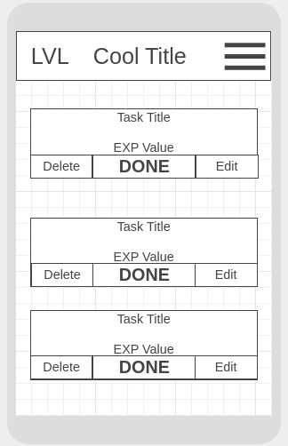

## Adventure-Tasks
[Deployed Adventure-Tasks](https://stoic-goldberg-8ae47a.netlify.app)
## Adventure-Tasks Description

To have a task To-Do list type app that makes completing the tasks rewarding in an RPG-style way. Giving user determined "experience" for clicking Done for whatever they need accomplished that day.

## Wireframes





## Component Hierarchy


## API and Data Sample

```json
{
  "records": [
    {
      "id": "recF3zLyCo6MAtBc5",
      "fields": {
        "exp": 20,
        "Task": "Take garbage out",
        "description": "The build up of our various foes can lower moral, best to dispose of them. ",
        "user": {
          "id": "usrhkXYe2GfxUKMO5",
          "email": "jesseeledath@gmail.com",
          "name": "Jesse Eledath"
        }
      },
      "createdTime": "2021-02-16T16:39:10.000Z"
    },
    {
      "id": "reckqe8hQtoStYHWm",
      "fields": {
        "Task": "Make breakfast",
        "exp": 80,
        "description": "No good can come from adventuring on an empty stomach. ",
        "user": {
          "id": "usrhkXYe2GfxUKMO5",
          "email": "jesseeledath@gmail.com",
          "name": "Jesse Eledath"
        }
      },
      "createdTime": "2021-02-16T16:39:10.000Z"
    },
    {
      "id": "recqsPPd1sosolGrC",
      "fields": {
        "exp": 10,
        "Task": "Clean dishes",
        "description": "Deal a death blow to the putrid filth. ",
        "user": {
          "id": "usrhkXYe2GfxUKMO5",
          "email": "jesseeledath@gmail.com",
          "name": "Jesse Eledath"
        }
      },
      "createdTime": "2021-02-16T16:39:10.000Z"
    }
  ]
}
```

#### MVP

- Have users POST tasks
- Render tasks
- Edit tasks/Delete them using corresponding buttons
- Clicking Done button give specified EXP

#### PostMVP

- Add Avatar
- Use animations for completing tasks
- Add level up sound
- Make a level up system

## Project Schedule

| Day       | Deliverable                                        | Status     |
| --------- | -------------------------------------------------- | ---------- |
| Feb 13-16 | Prompt / Wireframes / Priority Matrix / Timeframes | Complete |
| Feb 16    | Project Approval                                   | Complete |
| Feb 16    | Start Pseudocoding and creating components         | Complete |
| Feb 17    | Develope core features (the tasks/ level system)   | Complete |
| Feb 18    | Initial Clickable Model                            | Complete |
| Feb 19-20 | MVP/styling                                        | Incomplete |
| Feb 23    | Presentations                                      | Incomplete |

## Timeframes

| Component                      | Priority | Estimated Time | Time Invested |
| ------------------------------ | :------: | :------------: | :-----------: |
| Initial React set up + API key |    H     |      1hrs      |      1hr      |
| Working with API/creating info |    H     |      3hrs      |      3hrs     |
| Adding Form/requests           |    H     |      3hrs      |      3hrs     |
| Creating Tasks/formatting them |    H     |      3hrs      |      3hrs     |
| Creating sample Descriptions   |    H     |      3hrs      |      3hrs     |
| Making Sidebar                 |    H     |      3hrs      |               |
| Adding EXP elements            |    H     |      5hrs      |      6hrs     |
| Making titles                  |    H     |      3hrs      |      N/A      |
| Total                          |    H     |     29hrs      |               |

## SWOT Analysis

### Strengths:

I feel good about the wireframe/ hierarchy and now know what to do in the order that it should be done.

### Weaknesses:

I can imagine me getting hung up on the finer details and not being as timely with the core objectives. Furthermore without the implementation of user profiles finding ways to circumvent the limitations of the technology seem difficult to surmount.

### Opportunities:

Making this App should give me great experince in general layouts that are intuitive to the user and using all elements of CRUD in a sensible way for the user experince.
