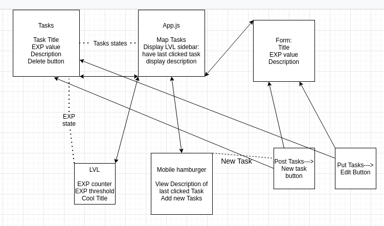

## Adventure-Tasks

## Adventure-Tasks Description

To have a task list type app that makes completing the tasks rewarding in an RPG-style way.

## Wireframes


## Component Hierarchy



## API and Data Sample

Show us a snippet of JSON returned by your Airtable (you can find it under the API documentation) so we know you can access it and get the info you need. This __must__ be properly formatted. An example is below:

```json
{
    "records": [
        {
            "id": "recONRzIUTuZ5lXaF",
            "fields": {
                "author": "Liz Yrineo",
                "setup": "Why did the tomato turn red?",
                "punchline": "Because it saw the salad dressing!"
            },
            "createdTime": "2020-11-30T16:03:09.000Z"
        },
        {
            "id": "rec3oYZ5Tp0AIDsKe",
            "fields": {
                "author": "Rachel Moskowitz",
                "setup": "What did the green grape say to the red grape?",
                "punchline": "Breathe, idiot, breathe!"
            },
            "createdTime": "2020-11-30T16:03:09.000Z"
        },
        {
            "id": "recA34tOaoE1IVeC1",
            "fields": {
                "author": "Gary Grant",
                "setup": "How do you make holy water?",
                "punchline": "You boil the hell out of it!"
            },
            "createdTime": "2020-11-30T16:03:09.000Z"
        }
    ],
    "offset": "recA34tOaoE1IVeC1"
}
```

#### MVP 

- Have users POST tasks
- Render tasks
- Edit task positions
- Make a level up system

#### PostMVP  

- Add Avatar
- Use animations for completing tasks
- Add level up sound

## Project Schedule

|  Day | Deliverable | Status
|---|---| ---|
|Feb 13-16| Prompt / Wireframes / Priority Matrix / Timeframes | Incomplete
|Feb 16| Project Approval | Incomplete
|Feb 16| Start Pseudocoding and creating components | Incomplete
|Feb 17| Develope core features (the tasks/ level system) | Incomplete
|Feb 18| Initial Clickable Model  | Incomplete
|Feb 19-20| MVP/styling | Incomplete
|Feb 23| Presentations | Incomplete

## Timeframes

| Component | Priority | Estimated Time | Time Invested | Actual Time |
| --- | :---: |  :---: | :---: | :---: |
| Adding Form | H | 3hrs| 3.5hrs | 3.5hrs |
| Working with API | H | 3hrs| 2.5hrs | 2.5hrs |
| Total | H | 6hrs| 5hrs | 5hrs |

## SWOT Analysis

### Strengths:

### Weaknesses:

### Opportunities:

### Threats:
